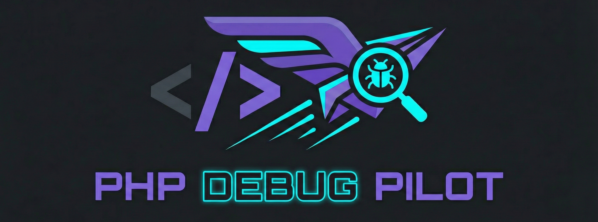

<p align="center">
  
</p>

# PHP Debug Pilot 🚀

[](https://packagist.org/packages/gemui/php-debug-pilot)
[](https://packagist.org/packages/gemui/php-debug-pilot)
[](https://github.com/Gemui/php-debug-pilot/blob/main/LICENSE)
[](https://packagist.org/packages/gemui/php-debug-pilot)
[](https://github.com/Gemui/php-debug-pilot/releases)

**Zero-Configuration PHP Debugging Setup.**

PHP Debug Pilot is an enterprise-grade CLI tool that automatically detects your environment, installs and configures Xdebug or Pcov, and generates ready-to-use launch configurations for your favorite IDE. Stop wrestling with `php.ini` and port mappings — just fly.

---

## ✨ Features

- **🔍 Environment Detection** — Automatically detects OS (macOS, Linux, Windows), Docker containers, and `php.ini` location
- **⚙️ Smart Configuration**
  - Configures **Xdebug** for step debugging (mode `debug`, auto-client-host)
  - Configures **Pcov** for fast coverage
  - Handles conflicts (e.g., disables Xdebug coverage when Pcov is active)
  - Idempotent — runs safely multiple times without duplicating config blocks
- **📦 Extension Management**
  - **Check Status** — View installed/enabled status of Xdebug and Pcov at a glance
  - **Toggle** — Enable or disable extensions with a single command
  - **Auto-Install** — Detects missing extensions and offers to install them for you (macOS/Linux)
- **💻 IDE Integration** — Generates project-specific config files for:
  - **VS Code** (`.vscode/launch.json`)
  - **PhpStorm** (`.idea/runConfigurations/XML`)
  - **Sublime Text** (`*.sublime-project`)
- **🏥 Health Checks** — Verifies your installation and reports actionable warnings (e.g., missing extensions, wrong modes)

---

## 📦 Installation

### Requirements

- **PHP** `^8.2`
- **Composer** (for Method 2 & 3 only)

### Method 1: Standalone PHAR (Zero Dependencies)

This is the **best method** if you don't want to manage global Composer dependencies or prefer a single executable file.

Download and install the standalone PHAR:

```bash
curl -sLO https://github.com/Gemui/php-debug-pilot/releases/latest/download/debug-pilot
chmod +x debug-pilot
sudo mv debug-pilot /usr/local/bin/debug-pilot
```

Verify the installation:

```bash
debug-pilot --version
```

### Method 2: Via Composer (Global)

Install once and use `debug-pilot` from anywhere:

```bash
composer global require gemui/php-debug-pilot
```

> **⚠️ Important:** Ensure your global Composer binaries directory is in your system's `$PATH`.
>
> Typically this is `~/.composer/vendor/bin` or `~/.config/composer/vendor/bin`.
>
> Add it to your shell profile if you haven't already:
> ```bash
> export PATH="$HOME/.composer/vendor/bin:$PATH"
> ```

After installing globally, you can use `debug-pilot` directly:

```bash
debug-pilot              # Interactive setup wizard
debug-pilot status       # Extension status table
debug-pilot toggle xdebug
```

### Method 3: Per-Project Installation

Add it as a dev dependency to a specific project:

```bash
composer require --dev gemui/php-debug-pilot
```

Then use it via Composer's local bin:

```bash
./vendor/bin/debug-pilot
```

---

## 🚀 Usage

### Interactive Setup

Run the setup wizard to configure extensions and generate IDE files:

```bash
debug-pilot
```

The tool will:
1. 🔍 Detect your environment
2. 🐛 Ask which debugger you want to configure (Xdebug / Pcov)
3. 💻 Ask which IDE you use
4. ✅ Write the configuration and verify the setup

### Check Status

See which extensions are installed and enabled:

```bash
debug-pilot status
```

**Output:**
```
 ┌─────────┬───────────┬─────────┐
 │ Driver  │ Installed │ Enabled │
 ├─────────┼───────────┼─────────┤
 │ xdebug  │ ✅        │ ✅      │
 │ pcov    │ ✅        │ ❌      │
 └─────────┴───────────┴─────────┘
```

### Enable / Disable Extensions

Toggle extension state without editing `php.ini` manually:

```bash
# Enable Xdebug
debug-pilot toggle xdebug

# Enable Pcov (and auto-disable Xdebug coverage)
debug-pilot toggle pcov
```

> 💡 **Tip:** If the extension is not installed, the tool will offer to install it for you automatically (on supported systems).

### Install Extensions

Manually install a specific extension:

```bash
# Install Xdebug
debug-pilot install xdebug

# Install Pcov
debug-pilot install pcov
```

> 🔧 The tool will automatically detect if auto-installation is supported on your system and run the appropriate installation command. If auto-installation is not available (e.g., Docker, Windows), it will display manual installation instructions.

### Non-Interactive Setup

Perfect for CI/CD pipelines or automated setup scripts:

```bash
# Configure Xdebug for VS Code
debug-pilot setup --debugger=xdebug --ide=vscode

# Configure Pcov for PhpStorm
debug-pilot setup --debugger=pcov --ide=phpstorm

# Custom host/port override
debug-pilot setup --debugger=xdebug --ide=vscode --host=192.168.1.5 --port=9000

# Configure specific Xdebug modes
debug-pilot setup --debugger=xdebug --ide=vscode --xdebug-mode=debug,develop,coverage
```

### Setup Options

| Option | Description | Default |
|--------|-------------|---------|
| `-p`, `--project-path` | Root path of your project (where IDE config is written) | Current directory |
| `-d`, `--debugger` | Debugger to configure (`xdebug`, `pcov`) | *(Prompts user)* |
| `-i`, `--ide` | IDE to configure (`vscode`, `phpstorm`, `sublime`) | *(Auto-detects or prompts)* |
| `--host` | Xdebug client host IP | `auto` (detects Docker host or `localhost`) |
| `--port` | Xdebug client port | `9003` |
| `--xdebug-mode` | Xdebug modes, comma-separated (`debug`, `develop`, `coverage`, `profile`, `trace`) | *(Prompts user with current modes pre-selected)* |

---

## 🐳 Using with Docker

### Generating Docker Config

Use the `init-docker` command to generate ready-to-use Docker configuration snippets:

```bash
# Generate an Xdebug Dockerfile snippet (printed to stdout)
debug-pilot init-docker

# Generate for Pcov instead
debug-pilot init-docker --debugger=pcov

# Also create a docker-compose.debug.yml override file
debug-pilot init-docker --write-compose
```

### Dockerfile Setup

Add the generated snippet to your Dockerfile (after `FROM php:8.x-*`):

```dockerfile
# === PHP Debug Pilot — Xdebug Configuration ===
RUN pecl install xdebug && docker-php-ext-enable xdebug
RUN echo 'xdebug.mode=debug' >> /usr/local/etc/php/conf.d/docker-php-ext-xdebug.ini \
    && echo 'xdebug.client_host=host.docker.internal' >> /usr/local/etc/php/conf.d/docker-php-ext-xdebug.ini \
    && echo 'xdebug.client_port=9003' >> /usr/local/etc/php/conf.d/docker-php-ext-xdebug.ini \
    && echo 'xdebug.start_with_request=yes' >> /usr/local/etc/php/conf.d/docker-php-ext-xdebug.ini
```

### Docker Compose Override

Use the `--write-compose` flag to generate a `docker-compose.debug.yml`:

```bash
debug-pilot init-docker --write-compose
```

Then run with both files:

```bash
docker compose -f docker-compose.yml -f docker-compose.debug.yml up
```

### Running Debug Pilot Inside a Container

You can run `debug-pilot` directly inside a running container. On official PHP Docker images (`php:*`), it will **auto-install** extensions for you:

```bash
# Enter your container
docker exec -it my-php-container bash

# Install debug-pilot
curl -sLO https://github.com/Gemui/php-debug-pilot/releases/latest/download/debug-pilot
chmod +x debug-pilot && mv debug-pilot /usr/local/bin/

# Run the interactive setup (auto-detects Docker, resolves host.docker.internal)
debug-pilot setup
```

> 💡 **Tip:** Debug Pilot automatically detects Docker environments and resolves `host.docker.internal` as the debug client host. On Linux Docker, it discovers the gateway IP from `/proc/net/route`.

### Init Docker Options

| Option | Description | Default |
|--------|-------------|---------|
| `-d`, `--debugger` | Debugger to configure (`xdebug`, `pcov`) | `xdebug` |
| `--port` | Debug client port | `9003` |
| `--write-compose` | Write `docker-compose.debug.yml` to project | `false` |
| `-p`, `--project-path` | Project root path | Current directory |

## 🖥️ Supported Platforms

- **Operating Systems:** macOS, Linux, Windows, Docker Containers
- **Debuggers:** Xdebug 3+, Pcov
- **IDEs:** VS Code, PhpStorm, Sublime Text 3/4

---

## 🔧 Troubleshooting

### "Extension is not installed" warning?

Run `debug-pilot install <extension>` (or `toggle`) and follow the interactive prompts to install it. Or install manually:

- **macOS:** `pecl install xdebug`
- **Ubuntu:** `sudo apt install php-xdebug`
- **Docker:** `RUN pecl install xdebug && docker-php-ext-enable xdebug`

### "Cannot write to php.ini"?

Run the tool with `sudo` if your `php.ini` is system-protected:

```bash
sudo debug-pilot setup
```

### PHAR not working?

Ensure the PHAR has execute permissions:

```bash
chmod +x debug-pilot
```

If you encounter "command not found", verify `/usr/local/bin` is in your `$PATH`:

```bash
echo $PATH | grep -q "/usr/local/bin" && echo "✅ Path is set" || echo "❌ Add /usr/local/bin to PATH"
```

---

## 🤝 Contributing

Contributions are welcome! Please feel free to submit a Pull Request.

1. Fork the repository
2. Create your feature branch (`git checkout -b feature/amazing-feature`)
3. Commit your changes (`git commit -m 'Add some amazing feature'`)
4. Push to the branch (`git push origin feature/amazing-feature`)
5. Open a Pull Request

---

## 📄 License

This project is licensed under the MIT License - see the [LICENSE](LICENSE) file for details.

---

## 🙏 Acknowledgments

**Made with ☕ by [Gemui](https://github.com/Gemui)**
